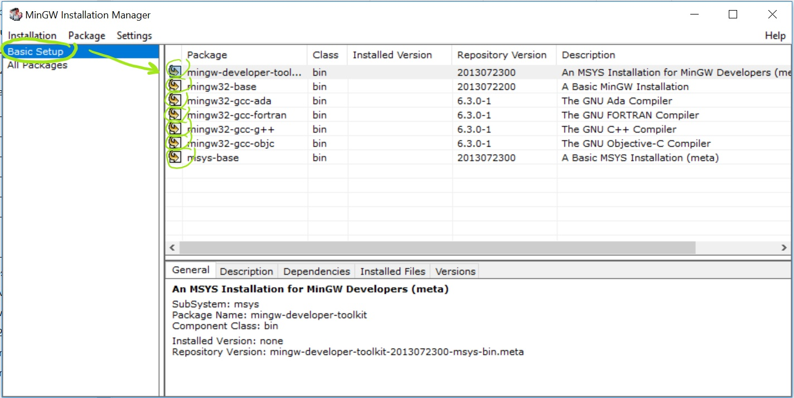
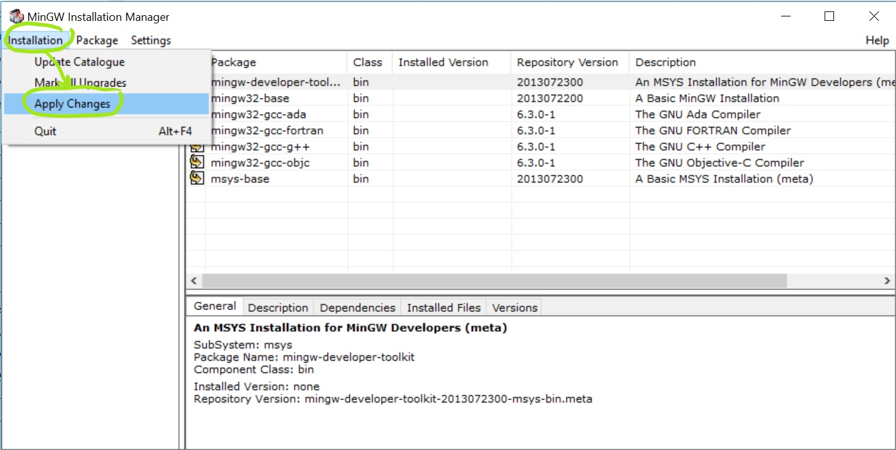
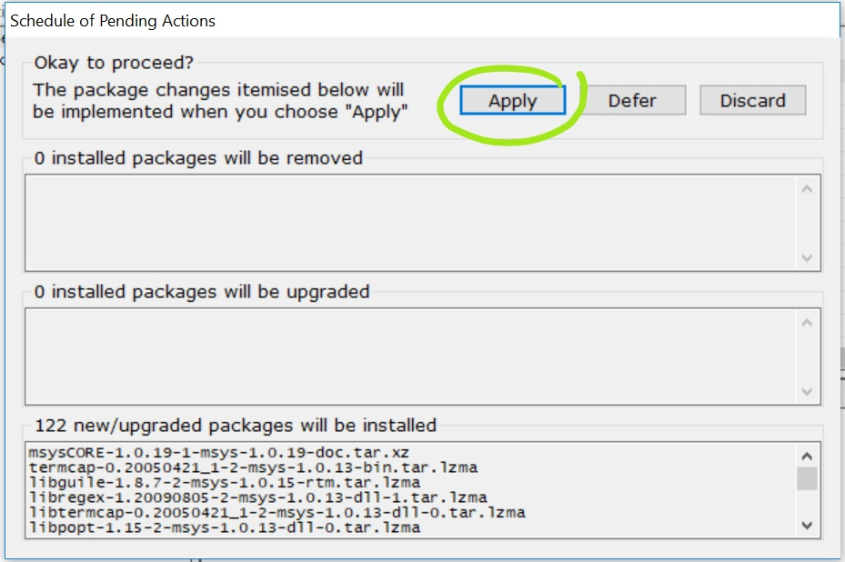

# Génie Logiciel

Repo pour les cours de GL à l'IUT de Cachan

## Organisation des dossiers

* Dossier `include`
* Dossier `src`

## Règles à respecter

* Avant de démarrer un __projet C__, vous devez avoir un __clone local__ de votre
repo.
* Chaque fichier `.h` créé doit être placé dans le dossier `include`.
* Chaque fichier `.c` créé doit être placé dans le dossier `src`.

## Par où commencer

### Comment cloner localement votre repo

* Récupérér le lien de votre repo :
    * Cliquer sur le bouton vert __Clone or download__ et copier l'URL

* Cloner avec __Visual Studio Code__ :
    * Ouvrir Visual Studio Code
    * Appuyer sur `F1`, ensuite taper `clone`, choisissez `Git: Clone`
    * Coller l'URL dans le champ demandé
    * Sauvegarder quelque part (à l'IUT, ce sera dans votre dossier qui est
    dans `C:\Travail`)
    * Cliquer sur `Open Repository`

### Branches, Commits, et Synchronisation
Pas d'explications, il faut pratiquer !

### À la maison

Vous devez installer les logiciels qui vous seront utiles pour travailler à
la maison. Dans l'ordre, installer :
* [Git](https://www.git-scm.com/download)
* [Visual Studio Code](https://code.visualstudio.com/download)
* [CMake](https://cmake.org/download/)
* [MinGW](https://sourceforge.net/projects/mingw/) 
    * Attention : veuillez suivre les captures d'écran ci-dessous pour
    installer proprement MinGW
  
  
  

Ensuite, installer les extensions sur Visual Studio Code
* Pour cela, cloner juste votre repo sous Visual Studio Code
* Accepter toutes les requêtes de Visual Studio Code.
